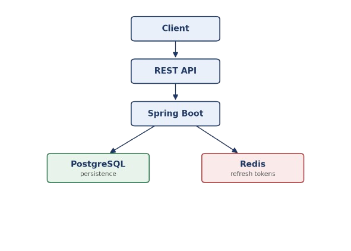

[🇬🇧 English](README.md) | [🇦🇷 Español](README.es.md)

# Sistema de Gestión de Órdenes

Backend para la gestión de productos, categorías y órdenes de compra, con autenticación JWT, autorización basada en roles y permisos, y control de propiedad de datos por usuario. Construido con Spring Boot 4 y Java 21.

## Índice

- [Funcionalidades](#funcionalidades)
- [API](#api)
- [Arquitectura y Decisiones de Diseño](#arquitectura-y-decisiones-de-diseño)
- [Estructura del Proyecto](#estructura-del-proyecto)
- [Seguridad](#seguridad)
- [Stack Tecnológico](#stack-tecnológico)
- [Requisitos](#requisitos)
- [Cómo Correrlo Localmente](#cómo-correrlo-localmente)
- [Cómo Probar la API](#cómo-probar-la-api)
- [Mejoras Pendientes](#mejoras-pendientes)
- [Roadmap](#roadmap)

## Funcionalidades

- Autenticar usuarios con JWT
- Rotar refresh tokens automáticamente, con detección de reuso
- Almacenar sesiones en Redis
- Autorizar acceso por rol
- Autorizar acceso por permiso
- Restringir el acceso y modificación de órdenes al propietario del recurso
- Containerizar el entorno con Docker Compose
- Versionar el esquema de base de datos con Flyway
- Registrar el historial de estados de las órdenes
- Organizar las categorías jerárquicamente

## ¿Por Qué Este Proyecto?

Este proyecto nació como una forma de profundizar conceptos utilizados en aplicaciones backend reales. El foco estuvo puesto en implementar autenticación y autorización robustas, separación por dominios, versionado de base de datos y un entorno reproducible mediante Docker Compose.

## Arquitectura



## Arquitectura y Decisiones de Diseño

- Los refresh tokens se hashean antes de guardarse en Redis, nunca se almacenan en texto plano.
- El acceso entre usuarios distintos devuelve 404, no 403, para no confirmar la existencia de recursos ajenos.
- La autorización es basada en permisos (`@RequiresPermission`), no solo en roles, así las reglas de acceso se pueden ajustar sin tocar la lógica de negocio.
- Flyway gestiona todos los cambios de esquema, por lo que el estado de la base de datos queda versionado y reproducible.
- El código está organizado por dominio (feature based packaging) en lugar de por capa técnica, así todo lo relacionado a un concepto (`order`, `product`, `category`, `user`) vive junto.

## Seguridad

- JWT access y refresh tokens
- Rotación de refresh tokens, con detección de reuso
- Refresh tokens hasheados y almacenados en Redis (por dispositivo)
- Owner scoping en el acceso y modificación de órdenes
- Autorización basada en roles y permisos

## Stack Tecnológico

| Categoría      | Tecnología           |
|----------------|------------------------|
| Lenguaje       | Java 21               |
| Framework      | Spring Boot 4         |
| Base de datos  | PostgreSQL            |
| Cache          | Redis                 |
| Migraciones    | Flyway                |
| Contenedores   | Docker Compose        |
| Seguridad      | JWT                   |
| Mapeo          | MapStruct             |

## API

REST API organizada por recursos:

- `/auth`
- `/users`
- `/orders`
- `/products`
- `/categories`

## Estructura del Proyecto

```
src/main/java
└── com.santiGalarza.ordermanagement
    ├── auth
    ├── user
    ├── order
    ├── product
    ├── category
    ├── common
    └── config
```

## Requisitos

- Java 21
- Docker
- Docker Compose

## Cómo Correrlo Localmente

Todo está containerizado.

```bash
git clone <repo-url>
cd <carpeta-del-proyecto>
cp .env.example .env   # completar secretos de DB/Redis/JWT
docker compose up
```

Esto levanta Postgres, Redis y la app (build multi stage, usuario no root en runtime). Flyway corre las migraciones automáticamente al iniciar. Los datos semilla (perfil dev) crean tres cuentas de prueba: admin, employee y customer, usadas en toda la suite de tests de la API descrita abajo.

## Cómo Probar la API

Todavía no hay suite de JUnit/Mockito. En su lugar, `requests.http` (formato IntelliJ HTTP Client) cubre Auth, Usuarios, Órdenes (con ítems y transiciones de estado), Categorías y Productos de punta a punta, incluyendo casos negativos: contraseña incorrecta, sin token, recurso inexistente, transiciones de estado inválidas y límites de permisos por rol.

Para correrlo: abrir `requests.http` en IntelliJ/WebStorm con el plugin HTTP Client, ejecutar primero los requests de login (encadenan el token resultante a los siguientes requests vía `client.global.set(...)`), y luego correr el resto en orden.

## Mejoras Pendientes

- Estandarizar las respuestas de error en todos los endpoints.
- Exponer el historial de estados de órdenes mediante un endpoint dedicado.
- Definir la granularidad de permisos de lectura entre cliente y empleado sobre ítems de orden.

## Roadmap

- [x] Autenticación JWT
- [x] Rotación de Refresh Tokens
- [x] Redis
- [x] Docker Compose
- [x] Flyway
- [ ] Tests unitarios (JUnit + Mockito)
- [ ] Documentación OpenAPI / Swagger
- [ ] CI con GitHub Actions
- [ ] Observabilidad con Spring Boot Actuator