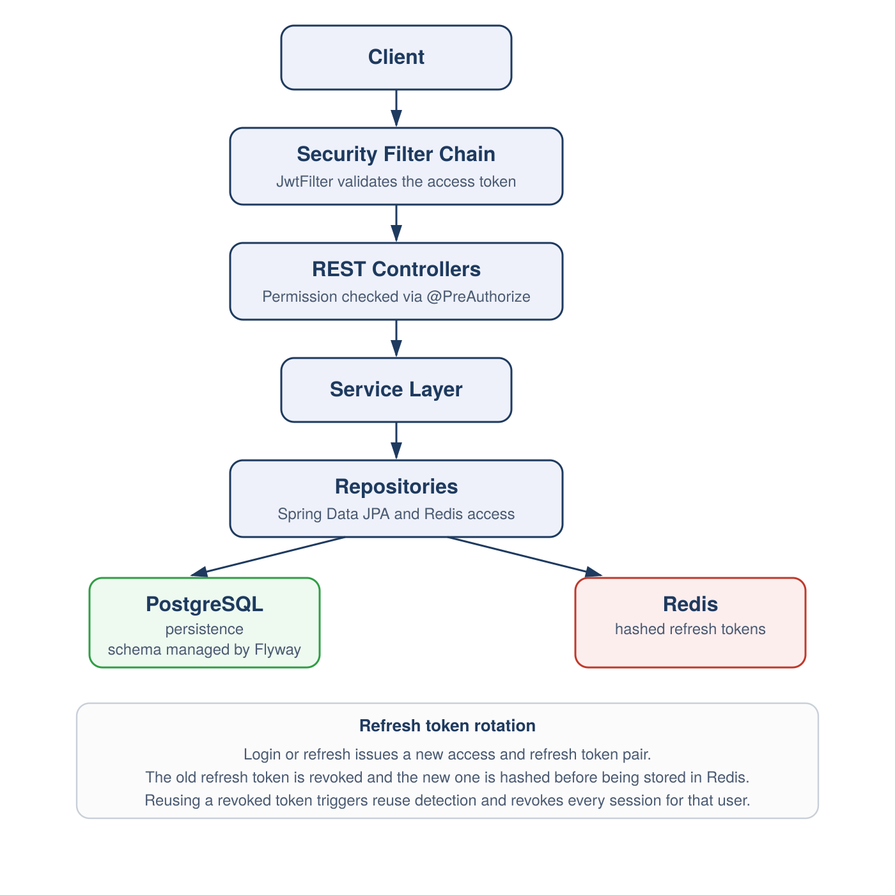

[🇬🇧 English](README.md) | [🇦🇷 Español](README.es.md)

# Order Management System

A backend for managing products, categories, and purchase orders, with JWT authentication, role and permission based authorization, and per user data ownership. Built with Spring Boot 4 and Java 21.

## Table of Contents

- [Features](#features)
- [API](#api)
- [Architecture & Design Decisions](#architecture--design-decisions)
- [Project Structure](#project-structure)
- [Security](#security)
- [Tech Stack](#tech-stack)
- [Requirements](#requirements)
- [Running Locally](#running-locally)
- [Testing](#testing)
- [Improvements Pending](#improvements-pending)
- [Roadmap](#roadmap)

## Features

- JWT Authentication (Access + Refresh Tokens)
- Refresh Token Rotation with Reuse Detection
- Hashed Refresh Tokens stored in Redis, tracked per device
- Token Versioning: changing a password invalidates every active session immediately
- Role Based Access Control (RBAC)
- Permission Based Authorization
- Resource Owner Scoping
- Product, Category and Order Management
- Hierarchical Categories
- DB Driven Order Status State Machine, with transition validation and full audit history
- Automatic Stock Restoration on order cancellation and confirmed returns
- Flyway Database Migrations
- Docker Compose Environment
- OpenAPI Documentation (SpringDoc + ReDoc)
- Tested across domain, service, and repository layers with JUnit 5, Mockito, and Testcontainers

## Why This Project

This project started as a way to go deeper into concepts used in real backend applications, rather than following a tutorial. A few decisions came directly out of that goal.

Order status is modeled as a database driven state machine (dedicated tables for statuses, valid transitions, and history) instead of a hardcoded enum. That keeps the business rule of "what transitions are allowed" in the data, so it can change without a code deploy, and every transition is auditable: who changed it, when, and why.

On the security side, refresh tokens are rotated and hashed before they touch Redis, reuse is detected with a grace period window, and every user carries a token version that increments on password change. That last part means a password change invalidates every existing session immediately instead of waiting for a token to expire on its own.

The permission model and the order status matrix are both externalized as data rather than hardcoded logic. The admin role operates within the full range of what that data currently allows, rather than through code changes for every operational scenario. Changing the matrix itself, such as adding a new permission or a new status transition, still goes through a Flyway migration today, not a live endpoint.

## Architecture



## Architecture & Design Decisions

- Order status is a DB driven state machine (`order_statuses`, `order_status_transitions`, `order_status_history`), not an enum, so allowed transitions live in data and every change is recorded with who made it, when, and why.
- Token versioning on the user entity means a password change invalidates every refresh token tied to that user immediately, rather than relying only on tokens expiring naturally.
- Permissions and order status transitions are modeled as data, not hardcoded logic, so the rules the system enforces live in the database, seeded and versioned through Flyway, rather than scattered across conditionals in code.
- Refresh tokens are hashed before being stored in Redis, never stored in plain text.
- Cross user access to resources returns 404, not 403, to avoid confirming the existence of resources that belong to someone else.
- Authorization is permission based (`@RequiresPermission`), not just role based, so access rules can be adjusted without touching business logic.
- Flyway handles all schema changes, so the database state is versioned and reproducible.
- The codebase is organized by domain (feature based packaging) rather than by technical layer, so everything related to one concept (`order`, `product`, `category`, `user`) lives together.

## Security

| Permission | USER | EMPLOYEE | ADMIN |
|------------|------|----------|-------|
| ORDER_READ | ✓ | ✓ | ✓ |
| ORDER_READ_ALL | | ✓ | ✓ |
| ORDER_CREATE | ✓ | ✓ | ✓ |
| ORDER_UPDATE | ✓ | ✓ | ✓ |
| ORDER_DELETE | ✓ | ✓ | ✓ |
| PRODUCT_READ | ✓ | ✓ | ✓ |
| PRODUCT_CREATE | | ✓ | ✓ |
| PRODUCT_UPDATE | | ✓ | ✓ |
| PRODUCT_DELETE | | | ✓ |
| CATEGORY_READ | ✓ | ✓ | ✓ |
| CATEGORY_CREATE | | ✓ | ✓ |
| CATEGORY_UPDATE | | ✓ | ✓ |
| CATEGORY_DELETE | | | ✓ |
| USER_READ | ✓ | ✓ | ✓ |
| USER_READ_ALL | | | ✓ |
| USER_UPDATE | ✓ | ✓ | ✓ |
| USER_UPDATE_ALL | | | ✓ |
| USER_DELETE | | | ✓ |
| USER_ASSIGN_ROLE | | | ✓ |
| USER_SET_ROLE | | | ✓ |
| STATUS_MANAGE | | ✓ | ✓ |

- JWT access and refresh tokens
- Refresh token rotation, with reuse detection and a grace period
- Refresh tokens hashed and stored in Redis, tracked per device
- Token versioning: password changes invalidate all active sessions
- Owner scoping on order access and modification
- Role and permission based authorization

> **Note on order permissions:** `ORDER_UPDATE` and `ORDER_DELETE` for the USER role
> are intentionally scoped. A customer can only modify or delete their own orders,
> and only while the order is still in a modifiable state (PENDING). Once an order
> is confirmed, no customer action can touch it. Attempting to access another user's
> order returns 404, not 403, to avoid confirming its existence.

## Tech Stack

| Category      | Technology                 |
|----------------|------------------------------|
| Language       | Java 21                     |
| Framework      | Spring Boot 4               |
| Database       | PostgreSQL                  |
| Cache          | Redis                       |
| Migrations     | Flyway                       |
| Containers     | Docker Compose                |
| Security       | JWT                           |
| Mapping        | MapStruct                     |
| Testing        | JUnit 5, Mockito, Testcontainers |
| Documentation  | SpringDoc OpenAPI + ReDoc       |

## API

The API is documented with SpringDoc OpenAPI and published via ReDoc on GitHub Pages.

📖 **Documentation:** https://santigalarza.github.io/order-management-system/

### Resources

- `/auth`
- `/users`
- `/orders`
- `/products`
- `/categories`

## Project Structure

```
src/main/java
└── com.santiGalarza.order_management
    ├── security
    ├── user
    ├── order
    ├── product
    ├── category
    ├── common
    └── config
```

Tests mirror this same structure under `src/test/java`, package for package.

## Requirements

- Java 21
- Docker
- Docker Compose

## Running Locally

The application is fully containerized.

```bash
git clone <repo-url>
cd <project-folder>
cp .env.example .env   # fill in DB/Redis/JWT secrets
docker compose up
```

This spins up Postgres, Redis, and the app (multi-stage build, non-root runtime user). Flyway runs migrations automatically on startup. Seed data (dev profile) creates three test accounts: admin, employee, and customer, used throughout the API test suite below.

## Testing

The project is tested at multiple layers, not just the happy path:

- **Domain tests** cover entity logic in isolation (`Order`, `Item`, `Product`), no Spring context required.
- **Security utility tests** cover JWT generation, validation, and expiry (`JwtUtil`), and refresh token hashing (`TokenHasher`).
- **Service layer tests** use JUnit 5 and Mockito to cover business logic and branching in isolation, including authentication flows, refresh token rotation and reuse detection, and order and user management.
- **Repository layer tests** run against a real PostgreSQL instance via Testcontainers rather than an in-memory database, so Postgres specific behavior and Flyway migrations are exercised the same way they run in production.

Run the automated suite with:

```bash
./mvnw test
```

Testcontainers requires Docker to be running locally, since it starts a disposable Postgres container for repository tests.

Separately, `requests.http` (IntelliJ HTTP Client format) covers Auth, Users, Orders (with items and status transitions), Categories, and Products end to end at the HTTP level, including negative paths: wrong password, missing token, nonexistent resource, invalid status transitions, and permission boundaries per role. To run it, open `requests.http` in IntelliJ or WebStorm with the HTTP Client plugin, run the login requests first (they chain the resulting token into subsequent requests via `client.global.set(...)`), then run the rest in order.

## Improvements Pending

- Standardize error responses across all endpoints.
- Expose order status history through a dedicated endpoint.
- Define read permission granularity between customer and employee on order items.

## Roadmap

- [x] JWT Authentication
- [x] Refresh Token Rotation
- [x] Redis
- [x] Docker Compose
- [x] Flyway
- [x] API documentation with SpringDoc OpenAPI and ReDoc
- [x] Unit tests (JUnit + Mockito)
- [ ] Integration tests (Testcontainers, MockMvc)
- [ ] CI with GitHub Actions
- [ ] Observability with Spring Boot Actuator